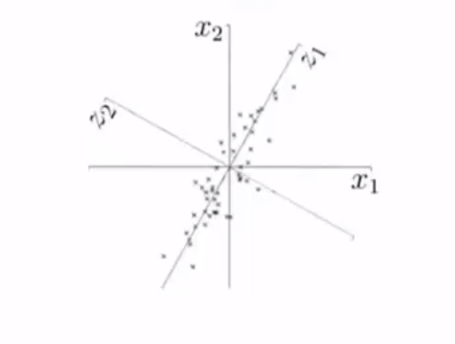
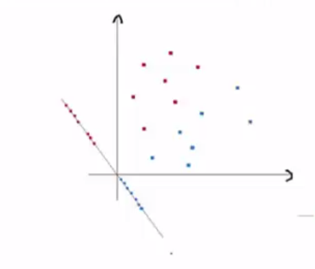
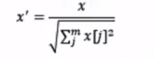
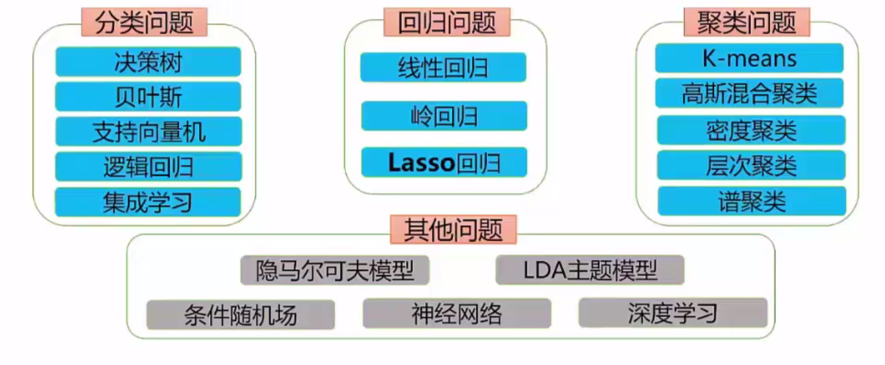

# 机器如何学习

### 一、数据预处理

##### 1.数据清洗

​		1).数据的完整性

​		2).数据的合法性

​		3).数据的一致性

​		4).数据的唯一性

​		5).数据的权威性

##### 2.数据集成

​	数据划分:

​		1).训练数据集

​		2).验证数据集

​		3).测试数据集

​	常用拆分方法:

​		1).留出法:70%作为训练集，30%作为测试集

​		2).k-折交叉验证法:将数据集划分为k个相似的互斥子集

##### 3.数据采样

​	问题:

​		数据不平衡即数据集的类别分布不均		

​	解决方法:

​		1).过采样:随机复制少数类的实例，增加样本类的代表

​		2).欠采样:随机消除样本类的多数类直至与少数类相平衡

### 二、特征过程

##### 1.特征编码

​	作用:将无法计算的字符信息转化为数值信息进行编码从而可以计算，如性别，籍贯等

​	编码方式

​		1).one-hot编码:采用N位状态寄存器来对N个状态进行编码

​		2).语义编码:可以识别语义关系，对有关联的文本查找数据关联

##### 2.特征选择

​	作用:过滤属性特征，如判断男女时生日和家庭住址等无关属性

​	方法:

​		1).过滤法:按照发散性或相关性对各特征进行评分，设定阈值完成特征选择

​		2).包裹法:选定特定算法，然后通过不断的启发方式来搜寻特征

​		3).嵌入法:采用正则将属性权重调整为0，这个属性相当于被舍弃了

##### 3.特征降维

​	作用:特征矩阵过大时，减少计算量与训练时间

​	方法:

​		1).主成分分析(PCA)

​		2).线性判别分析(LDA)

##### 4.规范化

​	作用:防止量级较大的属性占主导地位，导致迭代收敛速度减慢

​	方法:

​		1).标准化:通过减去均值然后除以方差(或标准差)
$$
x = (x-\mu)/\sigma
$$
​		2).区间缩放:将属性缩放到一个指定的最大和最小值(通常是1-0)之间
$$
x = (x-min)/(max-min)
$$
​		3).归一化:将某一属性特征的模长转化成1

# 机器学习方法分类

