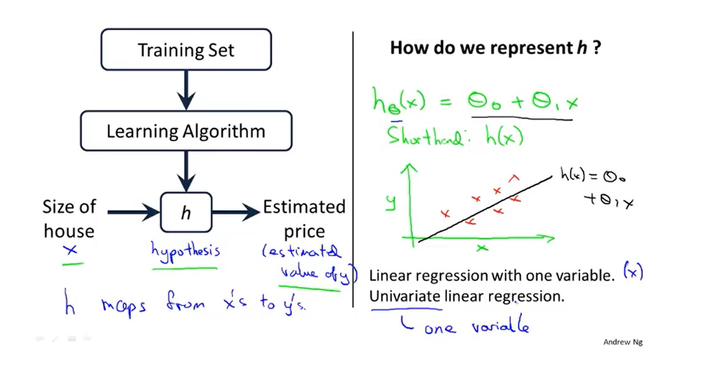
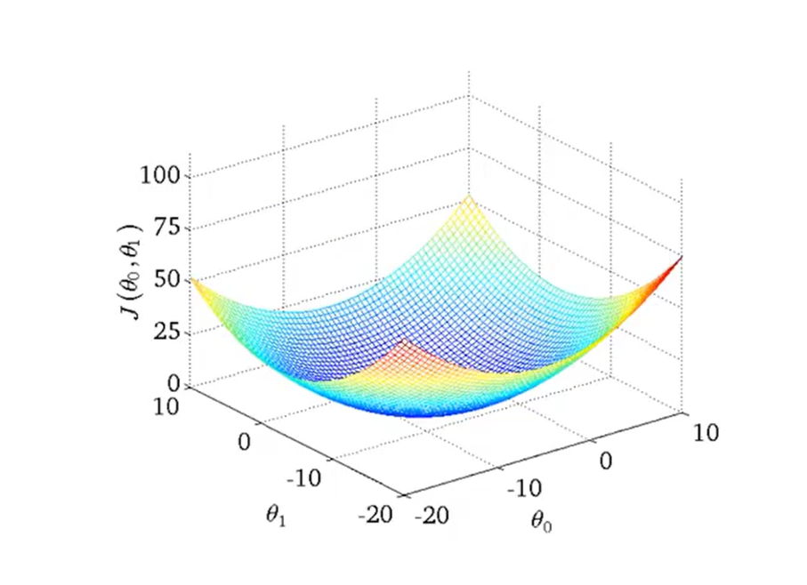

## 一、线性回归模型

##### 注:这是一个单变量线性回归

## 二、代价函数

### 1.假设函数图解

现实的例子中，数据会以很多点的形式给我们，我们想要解决回归问题，就需要将这些点拟合成一条直线，找到最优的θ0和θ1来使这条直线更能代表所有数据

### 2.简化假设函数构建

##### Hypothesis:假设函数

##### Parameters:参数

##### Cost Function:代价函数

##### Goal:优化目标

##### Simplified:简化函数

### 3.简化假设函数找出最优解

平方误差代价函数的主要思想就是将实际数据给出的值与我们拟合出的线的对应值做差，这样就能求出我们拟合出的直线与实际的差距了

### 4.非简化假设函数最优解

##### 3D曲面图:

##### 等高线图:

## 三、梯度下降

### 1.梯度下降定义

不停地改变**θ0**和**θ1**直到找到**J**的最小值或者**局部**最小值

### 2.梯度下降图像

不同的起始点有不同的最优解

### 3.梯度下降函数

Correct为同步更新正确做法,Incorrect为未同步更新错误做法
$$
\alpha为学习速率，即步子大小
$$

### 4.梯度下降导数项含义

### 5.梯度下降速率含义

下降速率过慢会增加成本，过快会超过最低点，即导数=0的部分，从而导致无法收敛或者发散

### 6.θ1处于局部最优点的梯度变化

不会再变化，因为此时导数项为0,0乘以梯度还是为0

##### 注:在梯度下降法中会自动采取更小的幅度

## 四、线性回归的梯度下降(适用于更多的数据集)

### 1.推导过程

### 2.注

##### 1).在线性回归中代入梯度下降算法只有全局最优解，没有局部最优解

##### 2).该算法有时被称为Batch梯度下降，该算法在每一次梯度下降都遍历了整个数据集的样本

##### 3).可用正规方程组方法的得到代价函数最小值，而不用多步骤使用梯度下降
