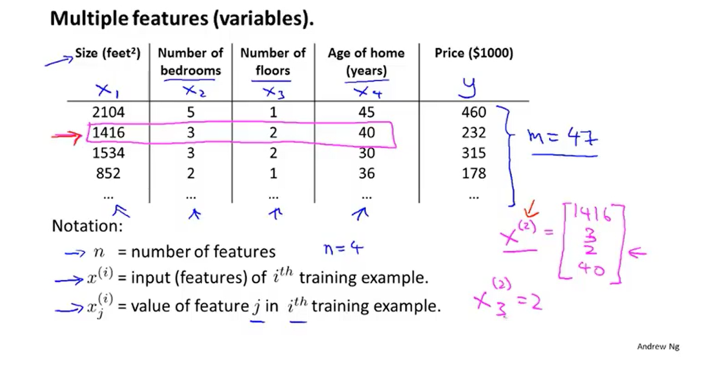
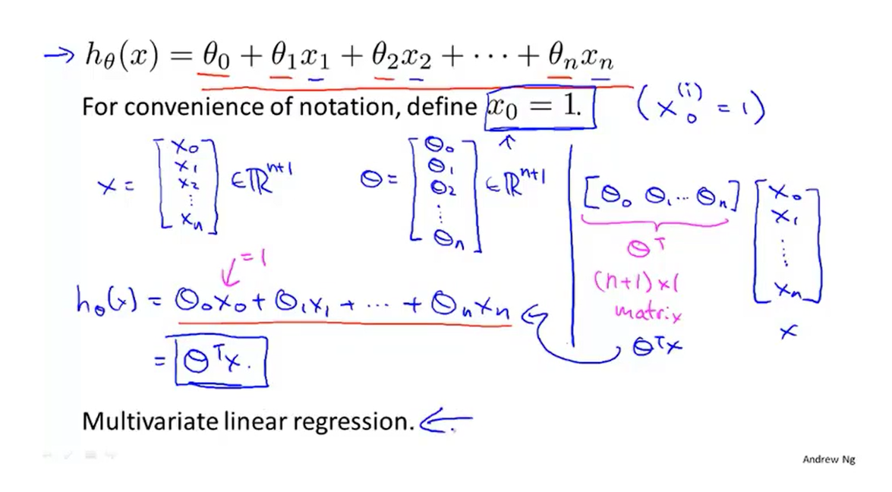
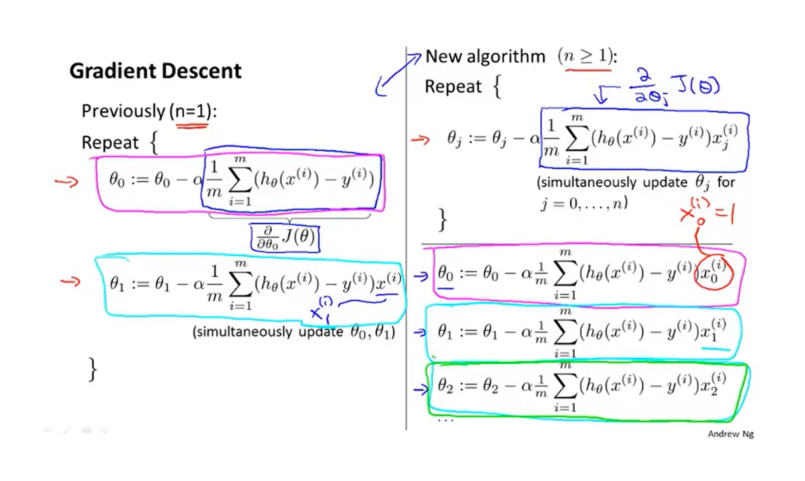
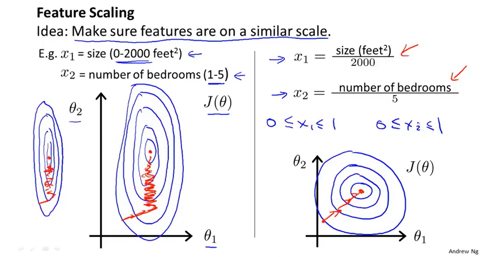
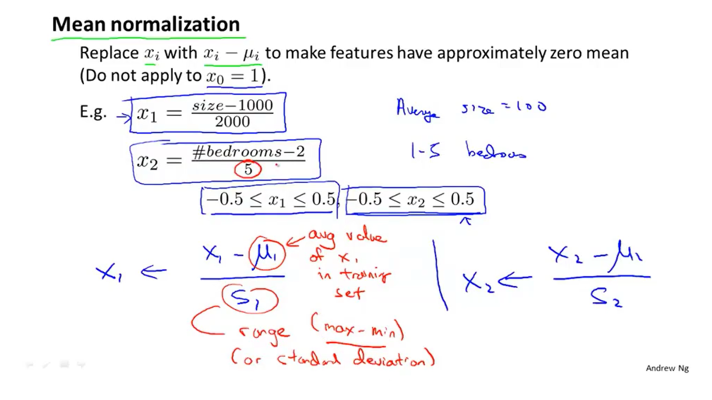
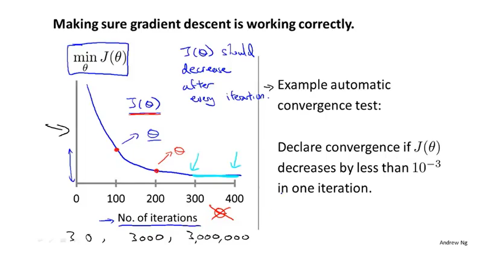
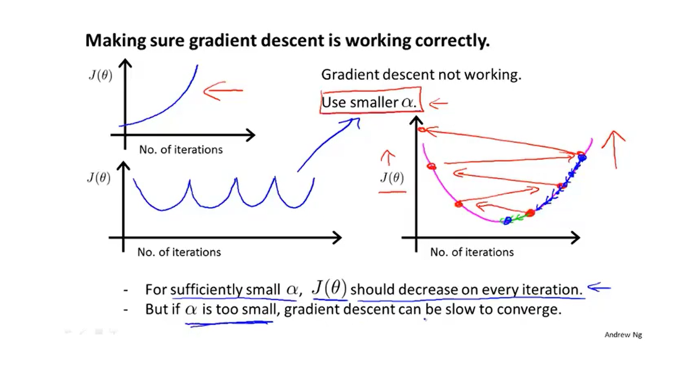

## 一、多元线性回归

### 1.多特征房价预测

##### 注:n代表特征属性数量，m代表样本数据数量

### 2.简化

##### 注:右边为内积，即θ的转置乘以x

## 二、多元梯度下降法

### 1.多元梯度下降公式

##### 注:i相当于行索引，j相当于列索引

### 2.多元梯度下降法:特征缩放

##### 注:特征缩放可以让梯度下降快一些，收敛所需迭代次数更少

##### 注:μ为数据平局值，s为标准差，但一般用最大值减最小值即可

### 3.多元梯度下降法:学习率

##### 1).自动收敛测试

##### 注:x轴代表收敛次数，y轴代表代价函数值

##### 2).收敛异常

##### 注:出现通常为学习率过大，数学家以证明随着学习率减小代价函数一定会下降，太小会收敛的很慢

