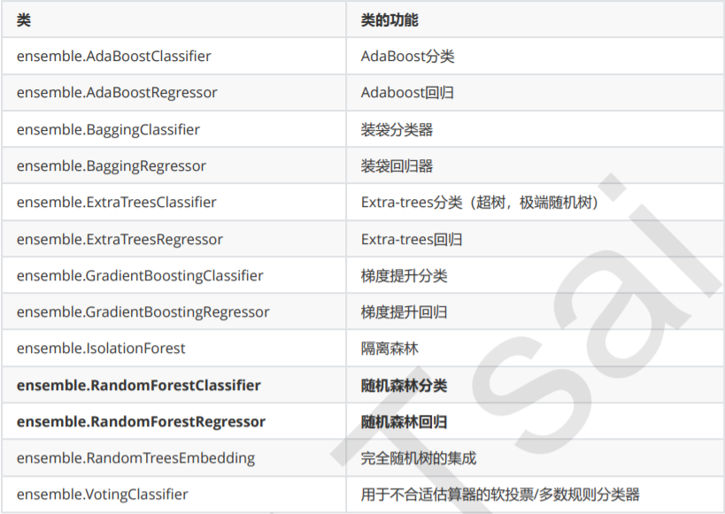
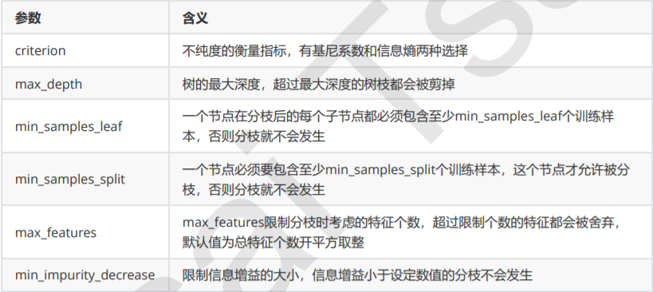
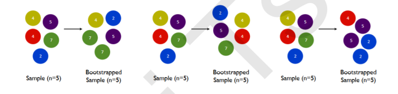
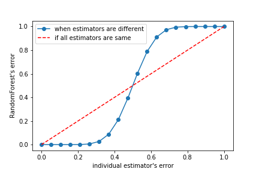
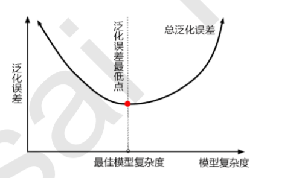
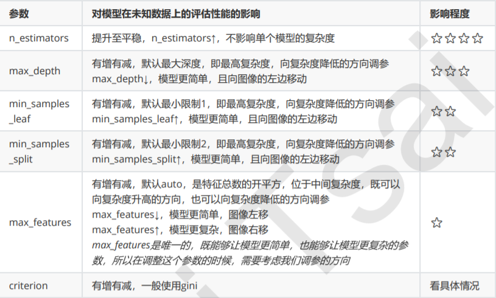

## 1 概述

### 1.1  集成算法概述

#### 1.1.1 含义

集成学习（ensemble learning）是时下非常流行的机器学习算法，它本身不是一个单独的机器学习算法，而是通
过在数据上构建多个模型，集成所有模型的建模结果。基本上所有的机器学习领域都可以看到集成学习的身影，在
现实中集成学习也有相当大的作用，它可以用来做市场营销模拟的建模，统计客户来源，保留和流失，也可用来预
测疾病的风险和病患者的易感性。在现在的各种算法竞赛中，**随机森林，梯度提升树（GBDT），Xgboost**等集成
算法的身影也随处可见，可见其效果之好，应用之广。

#### 1.1.2 目标

集成算法会考虑多个评估器的建模结果，汇总之后得到一个综合的结果，**以此来获取比单个模型更好的回归或**
**分类表现**。

#### 1.1.3 集成评估器

多个模型集成成为的模型叫做集成评估器（ensemble estimator），组成集成评估器的每个模型都叫做基评估器
（base estimator）。通常来说，有三类集成算法：**装袋法（Bagging），提升法（Boosting）和stacking**。


##### 注:袋装法是相互独立的评估器，提升法中的基评估器是相关的

### 1.2 sklearn中的集成算法

#### sklearn中的集成算法模块ensemble



<br>

## 2 RandomForestClassifier(随机森林分类器)

### 2.1 重要参数

#### 2.1.1 控制基评估器的参数



#### 2.1.2 n_estimators

##### 含义:

这是森林中树木的数量，即基评估器的数量。这个参数对随机森林模型的精确性影响是单调的，**n_estimators越**
**大，模型的效果往往越好**。但是相应的，任何模型都有决策边界，n_estimators达到一定的程度之后，随机森林的精确性往往不在上升或开始波动，并且，n_estimators越大，需要的计算量和内存也越大，训练的时间也会越来越长。对于这个参数，我们是渴望在训练难度和模型效果之间取得平衡。

##### 注:n_estimators的默认值在现有版本的sklearn中是10，但是在即将更新的0.22版本中，这个默认值为100。

<br>

##### 随机森林和单个决策树效益的对比代码(红酒数据集):

```python
#1. 导入我们需要的包
import numpy as np
import pandas as pd
from matplotlib import pyplot as plt
from sklearn import datasets
from sklearn import tree
from sklearn import model_selection
from sklearn import ensemble

#2. 导入需要的数据集
wine = datasets.load_wine()

#3. 随机森林和决策树建模对比
Xtrain, Xtest, Ytrain, Ytest = model_selection.train_test_split(wine.data,wine.target,test_size=0.3)

clf = tree.DecisionTreeClassifier(random_state=0)
rfc = ensemble.RandomForestClassifier(random_state=0)

clf = clf.fit(Xtrain,Ytrain)
rfc = rfc.fit(Xtrain,Ytrain)

score_c = clf.score(Xtest,Ytest)
score_r = rfc.score(Xtest,Ytest)

print("Single Tree:{}".format(score_c))
print("Random Forest:{}".format(score_r))

#4. 随机森林和决策树在一组交叉验证下的效果对比
clf = tree.DecisionTreeClassifier()
clf_s = model_selection.cross_val_score(clf,wine.data,wine.target,cv=10)

rfc = ensemble.RandomForestClassifier(n_estimators=25)
rfc_s = model_selection.cross_val_score(rfc,wine.data,wine.target,cv=10)

plt.plot(range(1,11),rfc_s,label = "RandomForest")
plt.plot(range(1,11),clf_s,label = "Decision Tree")
plt.legend()
plt.show()   

#5. 随机森林和决策树在十组交叉验证下的效果对比
rfc_l = []
clf_l = []

for i in range(10):
    rfc = ensemble.RandomForestClassifier(n_estimators=25)
    rfc_s = model_selection.cross_val_score(rfc,wine.data,wine.target,cv=10).mean()
    rfc_l.append(rfc_s)
    
    clf = tree.DecisionTreeClassifier()
    clf_s = model_selection.cross_val_score(clf,wine.data,wine.target,cv=10).mean()
    clf_l.append(clf_s)
    
plt.plot(range(1,11),rfc_l,label = "Random Forest")
plt.plot(range(1,11),clf_l,label = "Decision Tree")
plt.legend()
plt.show()
#是否有注意到，单个决策树的波动轨迹和随机森林一致？
#再次验证了我们之前提到的，单个决策树的准确率越高，随机森林的准确率也会越高

#6. n_estimators的学习曲线
superpa = []
for i in range(200):
    rfc = RandomForestClassifier(n_estimators=i+1,n_jobs=-1)
    rfc_s = cross_val_score(rfc,wine.data,wine.target,cv=10).mean()
    superpa.append(rfc_s)
print(max(superpa),superpa.index(max(superpa)))
plt.figure(figsize=[20,5])
plt.plot(range(1,201),superpa)
plt.show()
```

#### 2.1.3 random_state

随机森林的本质是一种装袋集成算法（bagging），装袋集成算法是对基评估器的预测结果进行平均或用多数表决
原则来决定集成评估器的结果。在刚才的红酒例子中，我们建立了25棵树，对任何一个样本而言，平均或多数表决原则下，当且仅当有**13棵**以上的树判断错误的时候，随机森林才会判断错误。单独一棵决策树对红酒数据集的分类准确率在0.85上下浮动，假设一棵树判断错误的可能性为0.2(ε)，那20棵树以上都判断错误的可能性是：
$$
erandomforest = \sum_{i=13}^{25}C_{25}^i\varepsilon^{i}(1 - \varepsilon)^{25-i} = 0.000369
$$
其中，i是判断错误的次数，也是判错的树的数量，ε是一棵树判断错误的概率，（1-ε）是判断正确的概率，共判对25-i次。采用组合，是因为25棵树中，有任意i棵都判断错误。

```python
import numpy as np
import pandas as pd
from matplotlib import pyplot as plt
from sklearn import datasets
from sklearn import tree
from sklearn import model_selection
from sklearn import ensemble
from scipy.special import comb
from scipy.special import comb

np.array([comb(25,i)*(0.2**i)*((1-0.2)**(25-i)) for i in range(13,26)]).sum()
#0.00036904803455582827
```

可见，**判断错误的几率非常小，这让随机森林在红酒数据集上的表现远远好于单棵决策树**。
那现在就有一个问题了：我们说袋装法服从多数表决原则或对基分类器结果求平均，这即是说，我们默认森林中的
每棵树应该是不同的，并且会返回不同的结果。设想一下，如果随机森林里所有的树的判断结果都一致（全判断对
或全判断错），那随机森林无论应用何种集成原则来求结果，都应该无法比单棵决策树取得更好的效果才对。但我
们使用了一样的类DecisionTreeClassifier，一样的参数，一样的训练集和测试集，为什么随机森林里的众多树会有不同的判断结果？

问到这个问题，很多小伙伴可能就会想到了：sklearn中的分类树DecisionTreeClassifier自带随机性，所以随机森
林中的树天生就都是不一样的。我们在讲解分类树时曾提到，决策树从最重要的特征中随机选择出一个特征来进行
分枝，因此每次生成的决策树都不一样，这个功能由参数random_state控制。
随机森林中其实也有random_state，用法和分类树中相似，只不过在分类树中，一个random_state只控制生成一
棵树，而**随机森林中的random_state控制的是生成森林的模式**，**而非让一个森林中只有一棵树**。

```python
wine = datasets.load_wine()

Xtrain, Xtest, Ytrain, Ytest = model_selection.train_test_split(wine.data,wine.target,test_size=0.3)

rfc = ensemble.RandomForestClassifier(n_estimators=20,random_state=2)
rfc = rfc.fit(Xtrain, Ytrain)

#随机森林的重要属性之一：estimators，查看森林中树的状况
rfc.estimators_[0].random_state
for i in range(len(rfc.estimators_)):
    print(rfc.estimators_[i].random_state)
```

#### 2.1.4 bootstrap & oob_score

要让基分类器尽量都不一样，一种很容易理解的方法是使用不同的训练集来进行训练，而袋装法正是通过有放回的
随机抽样技术来形成不同的训练数据，bootstrap就是用来控制抽样技术的参数。

在一个含有n个样本的原始训练集中，我们进行随机采样，每次采样一个样本，并在抽取下一个样本之前将该样本
放回原始训练集，也就是说下次采样时这个样本依然可能被采集到，这样采集n次，最终得到一个和原始训练集一
样大的，n个样本组成的自助集。由于是随机采样，这样每次的自助集和原始数据集不同，和其他的采样集也是不
同的。这样我们就可以自由创造取之不尽用之不竭，并且互不相同的自助集，用这些自助集来训练我们的基分类
器，我们的基分类器自然也就各不相同了。

**bootstrap参数默认True，代表采用这种有放回的随机抽样技术。通常，这个参数不会被我们设置为False**



然而有放回抽样也会有自己的问题。由于是有放回，一些样本可能在同一个自助集中出现多次，而其他一些却可能
被忽略，一般来说，自助集大约平均会包含63%的原始数据。因为每一个样本被抽到某个自助集中的概率为：
$$
1-(1-\frac{1}{n})^n
$$
**n次只要有1次被抽中就行**

当n足够大时，这个概率收敛于1-(1/e)，约等于0.632。因此，会有约37%的训练数据被浪费掉，没有参与建模，
这些数据被称为袋外数据(out of bag data，简写为oob)。除了我们最开始就划分好的测试集之外，这些数据也可
以被用来作为集成算法的测试集。**也就是说，在使用随机森林时，我们可以不划分测试集和训练集，只需要用袋外**
**数据来测试我们的模型即可**。当然，这也不是绝对的，当n和n_estimators都不够大的时候，很可能就没有数据掉
落在袋外，自然也就无法使用oob数据来测试模型了。

如果希望用袋外数据来测试，则需要在实例化时就将oob_score这个参数调整为True，训练完毕之后，我们可以用
随机森林的另一个重要属性：oob_score_来查看我们的在袋外数据上测试的结果：

```python
#无需划分训练集和测试集

rfc = RandomForestClassifier(n_estimators=25,oob_score=True) #oob_score_默认为False
rfc = rfc.fit(wine.data,wine.target)
#查看袋外数据训练得分
rfc.oob_score_
```

### 2.2 重要属性和接口

```python
rfc = ensemble.RandomForestClassifier(n_estimators=25)
rfc = rfc.fit(Xtrain, Ytrain)
print(rfc.score(Xtest,Ytest))
print()
print(rfc.feature_importances_)
print()
print(rfc.apply(Xtest))
print()
print(rfc.predict(Xtest))
print()
print(rfc.predict_proba(Xtest))
```

### Bonus：Bagging的另一个必要条件

在使用袋装法时要求基评估器要尽量独立。其实，袋装法还有另一个必要条件：基分类器的判断准确率至少要超过随机分类器，即时说，**基分类器的判断准确率至少要超过50%**。之前我们已经展示过随机森林的准确率公式，基于这个公式，我们画出了基分类器的误差率ε和随机森林的误差率之间的图像。

```python
import numpy as np

x = np.linspace(0,1,20)
y = []
for epsilon in np.linspace(0,1,20):
    E = np.array([comb(25,i)*(epsilon**i)*((1-epsilon)**(25-i))
                  for i in range(13,26)]).sum()
    y.append(E)
plt.plot(x,y,"o-",label="when estimators are different")
plt.plot(x,x,"--",color="red",label="if all estimators are same")
plt.xlabel("individual estimator's error")
plt.ylabel("RandomForest's error")
plt.legend()
plt.savefig("./基分类器的误差率和随机森林的误差率.png")
plt.show()
```



<br>

## 3 RandomForestRegressor

### 3.1 重要参数，属性与接口

#### criterion(与决策树的一样)

回归树衡量分枝质量的指标，支持的标准有三种：
1）输入"mse"使用均方误差mean squared error(MSE)，父节点和叶子节点之间的均方误差的差额将被用来作为
特征选择的标准，这种方法通过使用叶子节点的均值来最小化L2损失
2）输入“friedman_mse”使用费尔德曼均方误差，这种指标使用弗里德曼针对潜在分枝中的问题改进后的均方误差
3）输入"mae"使用绝对平均误差MAE（mean absolute error），这种指标使用叶节点的中值来最小化L1损失

#### 重要属性和接口

最重要的属性和接口，都与随机森林的分类器相一致，还是apply, fit, predict和score最为核心。值得一提的是，**随机森林回归并没有predict_proba这个接口**，因为对于回归来说，并不存在一个样本要被分到某个类别的概率问
题，因此没有predict_proba这个接口。

#### 随机森林回归用法代码

(和决策树完全一致，除了多了参数n_estimators)

```python
from sklearn import datasets
from sklearn import model_selection
from sklearn import ensemble
from sklearn import metrics

boston = datasets.load_boston()

# 随机森林回归
regressor = ensemble.RandomForestRegressor(n_estimators=100,random_state=0)
model_selection.cross_val_score(regressor, boston.data, boston.target, cv=10
               ,scoring = "neg_mean_squared_error")

# 打分指标
sorted(metrics.SCORERS.keys())
```

### 3.2 实例：用随机森林回归填补缺失值

```python
# 1.导入相应的模块

import numpy as np
import pandas as pd
from matplotlib import pyplot as plt
from sklearn import impute
from sklearn import datasets
from sklearn import model_selection
from sklearn import ensemble
from sklearn import metrics

# 2.导入波士顿房价数据集，并查看相应数据状态

boston = datasets.load_boston()

#总共506*13=6578个数据
print(boston.data.shape) #(506, 13)
print()
print(boston.target.shape) #(506,)
print()

X_full, y_full = boston.data, boston.target
n_samples = X_full.shape[0]
n_features = X_full.shape[1]

print(n_samples) #506
print()
print(n_features) #13
print()

# 3. 为完整数据集放入缺失值

#首先确定我们希望放入的缺失数据的比例，在这里我们假设是50%，那总共就要有3289个数据缺失
rng = np.random.RandomState(0) #设置随机性，不用每次在函数内部去设置
missing_rate = 0.5 #缺失数据的比例
n_missing_samples = int(np.floor(n_samples * n_features * missing_rate)) #np.floor向下取整，返回.0格式的浮点数

#创造一个数组，包含3289个分布在0~506中间的行索引，和3289个分布在0~13之间的列索引，利用索引来为数据中的任意3289个位置赋空值
#然后我们用0，均值和随机森林来填写这些缺失值，然后查看回归的结果如何
missing_features = rng.randint(0,n_features,n_missing_samples) #randint(下限,上限,n) 请在上限和下限直接取出n个整数
missing_samples = rng.randint(0,n_samples,n_missing_samples)

#我们现在采样了3289个数据，远远超过我们的样本量506，所以我们使用随机抽取的函数randint。
#但如果我们需要的数据量小于我们的样本量506，那我们可以采用np.random.choice来抽样
#choice会随机抽取不重复的随机数，因此可以帮助我们让数据更加分散，确保数据不会集中在一些行中
#missing_samples = rng.choice(dataset.data.shape[0],n_missing_samples,replace=False)
X_missing = X_full.copy()
y_missing = y_full.copy()
X_missing[missing_samples,missing_features] = np.nan
X_missing = pd.DataFrame(X_missing) #转换成DataFrame方便后续各种操作，numpy对矩阵的运算速度快，但是在索引等功能上却不如pandas

# 4. 使用均值或0填充缺失值

#使用均值进行填补
imp_mean = impute.SimpleImputer(missing_values=np.nan, strategy='mean') #missing_values:被填补的值，strategy:填补策略
X_missing_mean = imp_mean.fit_transform(X_missing) #fit_transform=训练(fit)+导出(predict)

#使用0进行填补
imp_0 = impute.SimpleImputer(missing_values=np.nan, strategy="constant",fill_value=0) #constant:常数，fill_value:被填补常数值
X_missing_0 = imp_0.fit_transform(X_missing)

#验证有无空值
pd.DataFrame(X_missing_mean).isnull().sum()

# 5.使用随机森林填补缺失值

"""
使用随机森林回归填补缺失值
任何回归都是从特征矩阵中学习，然后求解连续型标签y的过程，之所以能够实现这个过程，是因为回归算法认为，特征
矩阵和标签之前存在着某种联系。实际上，标签和特征是可以相互转换的，比如说，在一个“用地区，环境，附近学校数
量”预测“房价”的问题中，我们既可以用“地区”，“环境”，“附近学校数量”的数据来预测“房价”，也可以反过来，
用“环境”，“附近学校数量”和“房价”来预测“地区”。而回归填补缺失值，正是利用了这种思想。
对于一个有n个特征的数据来说，其中特征T有缺失值，我们就把特征T当作标签，其他的n-1个特征和原本的标签组成新
的特征矩阵。那对于T来说，它没有缺失的部分，就是我们的Y_test，这部分数据既有标签也有特征，而它缺失的部
分，只有特征没有标签，就是我们需要预测的部分。

特征T不缺失的值对应的其他n-1个特征 + 本来的标签：X_train
特征T不缺失的值：Y_train

特征T缺失的值对应的其他n-1个特征 + 本来的标签：X_test
特征T缺失的值：未知，我们需要预测的Y_test

这种做法，对于某一个特征大量缺失，其他特征却很完整的情况，非常适用。
那如果数据中除了特征T之外，其他特征也有缺失值怎么办？
答案是遍历所有的特征，从缺失最少的开始进行填补（因为填补缺失最少的特征所需要的准确信息最少）。
填补一个特征时，先将其他特征的缺失值用0代替，每完成一次回归预测，就将预测值放到原本的特征矩阵中，再继续填
补下一个特征。每一次填补完毕，有缺失值的特征会减少一个，所以每次循环后，需要用0来填补的特征就越来越少。当
进行到最后一个特征时（这个特征应该是所有特征中缺失值最多的），已经没有任何的其他特征需要用0来进行填补了，
而我们已经使用回归为其他特征填补了大量有效信息，可以用来填补缺失最多的特征。
遍历所有的特征后，数据就完整，不再有缺失值了。

"""
X_missing_reg = X_missing.copy()
sortindex = np.argsort(X_missing_reg.isnull().sum(axis=0)).values #把特征用缺失值的数量进行排序，由小到大
for i in sortindex:
    #构建我们的新特征矩阵和新标签
    df = X_missing_reg
    fillc = df.iloc[:,i]
    df = pd.concat([df.iloc[:,df.columns != i],pd.DataFrame(y_full)],axis=1)
    
    #在新特征矩阵中，对含有缺失值的列，进行0的填补
    df_0 = impute.SimpleImputer(missing_values=np.nan,
                        strategy='constant',fill_value=0).fit_transform(df)
    
    #找出我们的训练集和测试集
    Ytrain = fillc[fillc.notnull()]
    Ytest = fillc[fillc.isnull()]
    Xtrain = df_0[Ytrain.index,:]
    Xtest = df_0[Ytest.index,:]
    
    #用随机森林回归来填补缺失值
    rfc = ensemble.RandomForestRegressor(n_estimators=100)
    rfc = rfc.fit(Xtrain, Ytrain)
    Ypredict = rfc.predict(Xtest)
    
    #将填补好的特征返回到我们的原始的特征矩阵中
    X_missing_reg.loc[X_missing_reg.iloc[:,i].isnull(),i] = Ypredict
    
# 6.对填补好的数据进行建模

#对所有数据进行建模，取得MSE结果
X = [X_full,X_missing_mean,X_missing_0,X_missing_reg]
mse = []
for x in X:
    estimator = ensemble.RandomForestRegressor(random_state=0, n_estimators=100)
    scores = model_selection.cross_val_score(estimator,x,y_full,scoring='neg_mean_squared_error',
cv=5).mean()
    mse.append(scores * -1)
    
# 7.用所得结果画出条形图

x_labels = ['Full data',
            'Zero Imputation',
            'Mean Imputation',
            'Regressor Imputation']
colors = ['r', 'g', 'b', 'orange']
plt.figure(figsize=(12, 6))
ax = plt.subplot(111)
for i in np.arange(len(mse)):
    ax.barh(i, mse[i],color=colors[i], alpha=0.6, align='center')
ax.set_title('Imputation Techniques with Boston Data')
ax.set_xlim(left=np.min(mse) * 0.9,
             right=np.max(mse) * 1.1)
ax.set_yticks(np.arange(len(mse)))
ax.set_xlabel('MSE')
ax.set_yticklabels(x_labels)
plt.show()
```

## 4 机器学习中调参的基本思想

在机器学习中，我们用来衡量模型在未知数据上的准确率的指标，叫做**泛化误差**



#### 4.1 调参原理

##### 1）模型太复杂或者太简单，都会让泛化误差高，我们追求的是位于中间的平衡点

##### 2）模型太复杂就会过拟合，模型太简单就会欠拟合

##### 3）对树模型和树的集成模型来说，树的深度越深，枝叶越多，模型越复杂

##### 4）树模型和树的集成模型的目标，都是减少模型复杂度，把模型往图像的左边移动


#### 4.2 调参重要程度



## 5 实例：随机森林在乳腺癌数据上的调参

```python
# 1.导入需要的库
from sklearn.datasets import load_breast_cancer
from sklearn.ensemble import RandomForestClassifier
from sklearn.model_selection import GridSearchCV
from sklearn.model_selection import cross_val_score
import matplotlib.pyplot as plt
import pandas as pd
import numpy as np

# 2.导入数据集，并探索数据
data = load_breast_cancer()
data.data.shape

#可以看到，乳腺癌数据集有569条记录，30个特征，单看维度虽然不算太高，但是样本量非常少。过拟合的情况可能存在

# 3.进行一次简单的建模，看看模型本身在数据集上的效果
rfc = RandomForestClassifier(n_estimators=100,random_state=90)
score_pre = cross_val_score(rfc,data.data,data.target,cv=10).mean()
score_pre #0.9666925935528475

#这里可以看到，随机森林在乳腺癌数据上的表现本就还不错，在现实数据集上，基本上不可能什么都不调就看到95%以上的准确率

# 4.随机森林调整的第一步：调整n_estimators
scorel = []
for i in range(0,200,10):
    rfc = RandomForestClassifier(n_estimators=i+1,
                                 n_jobs=-1,
                                 random_state=90)
    score = cross_val_score(rfc,data.data,data.target,cv=10).mean()
    scorel.append(score)
print(max(scorel),(scorel.index(max(scorel))*10)+1) #0.9684480598046841 41
plt.figure(figsize=[20,5])
plt.plot(range(1,201,10),scorel)
plt.show()

# 5.在确定好的范围内，进一步细化学习曲线
scorel = []
for i in range(35,45):
    rfc = RandomForestClassifier(n_estimators=i,
                                 n_jobs=-1,
                                 random_state=90)
    score = cross_val_score(rfc,data.data,data.target,cv=10).mean()
    scorel.append(score)
print(max(scorel),([*range(35,45)][scorel.index(max(scorel))])) #0.9719568317345088 39
plt.figure(figsize=[20,5])
plt.plot(range(35,45),scorel)
plt.show()

# 6.为网格搜索做准备，书写网格搜索的参数
"""
有一些参数是没有参照的，很难说清一个范围，这种情况下我们使用学习曲线，看趋势
从曲线跑出的结果中选取一个更小的区间，再跑曲线

param_grid = {'n_estimators':np.arange(0, 200, 10)}
param_grid = {'max_depth':np.arange(1, 20, 1)}
    
param_grid = {'max_leaf_nodes':np.arange(25,50,1)}
 对于大型数据集，可以尝试从1000来构建，先输入1000，每100个叶子一个区间，再逐渐缩小范围
有一些参数是可以找到一个范围的，或者说我们知道他们的取值和随着他们的取值，模型的整体准确率会如何变化，这
样的参数我们就可以直接跑网格搜索
param_grid = {'criterion':['gini', 'entropy']}
param_grid = {'min_samples_split':np.arange(2, 2+20, 1)}
param_grid = {'min_samples_leaf':np.arange(1, 1+10, 1)}

param_grid = {'max_features':np.arange(5,30,1)}

"""

# 7.开始按照参数对模型整体准确率的影响程度进行调参，首先调整max_depth

param_grid = {'max_depth':np.arange(1, 20, 1)}

# 一般根据数据的大小来进行一个试探，乳腺癌数据很小，所以可以采用1~10，或者1~20这样的试探
# 但对于像digit recognition那样的大型数据来说，我们应该尝试30~50层深度（或许还不足够
#   更应该画出学习曲线，来观察深度对模型的影响

rfc = RandomForestClassifier(n_estimators=39
                             ,random_state=90
                           )
GS = GridSearchCV(rfc,param_grid,cv=10)
GS.fit(data.data,data.target)

print(GS.best_params_) #{'max_depth': 11}
print(GS.best_score_) #0.9718804920913884
```

在这里，我们注意到，将max_depth设置为有限之后，模型的准确率下降了。限制max_depth，是让模型变得简
单，把模型向左推，而模型整体的准确率下降了，即整体的泛化误差上升了，这说明**模型现在位于图像左边**，**即泛**
**化误差最低点的左边**（偏差为主导的一边）。通常来说，随机森林应该在泛化误差最低点的右边，树模型应该倾向
于过拟合，而不是拟合不足。这和数据集本身有关，但也有可能是我们调整的n_estimators对于数据集来说太大，因此将模型拉到泛化误差最低点去了。然而，既然我们追求最低泛化误差，那我们就保留这n_estimators，除非有其他的因素，可以帮助我们达到更高的准确率。

**当模型位于图像左边时，我们需要的是增加模型复杂度（增加方差，减少偏差）的选项，因此max_depth应该尽量大**，**min_samples_leaf和min_samples_split都应该尽量小**。这几乎是在说明，除了max_features，我们没有任何参数可以调整了，因为max_depth，min_samples_leaf和min_samples_split是剪枝参数，是减小复杂度的参数。在这里，我们可以预言，我们已经非常接近模型的上限，模型很可能没有办法再进步了。
