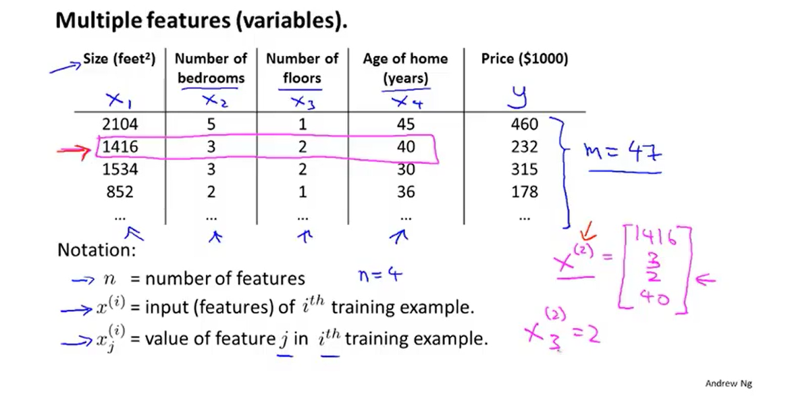
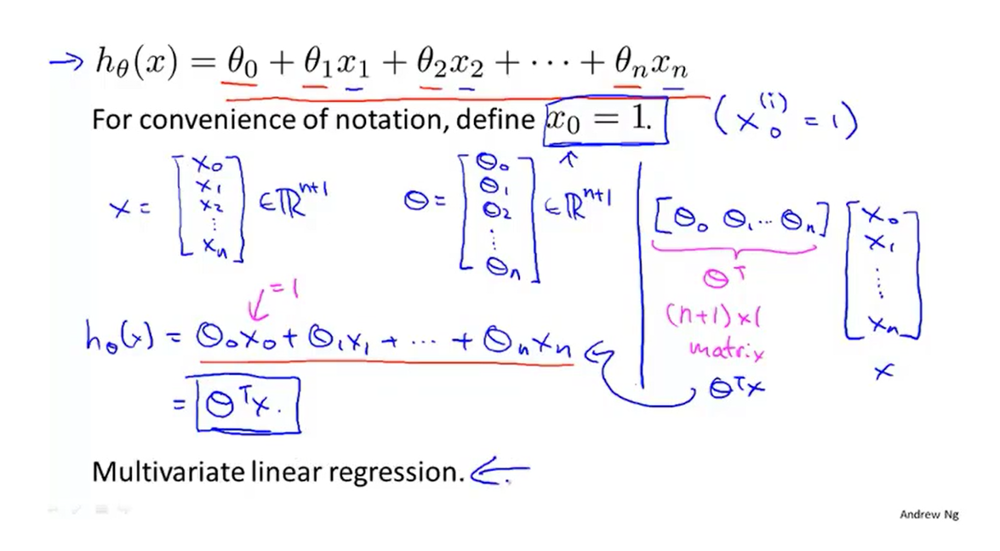
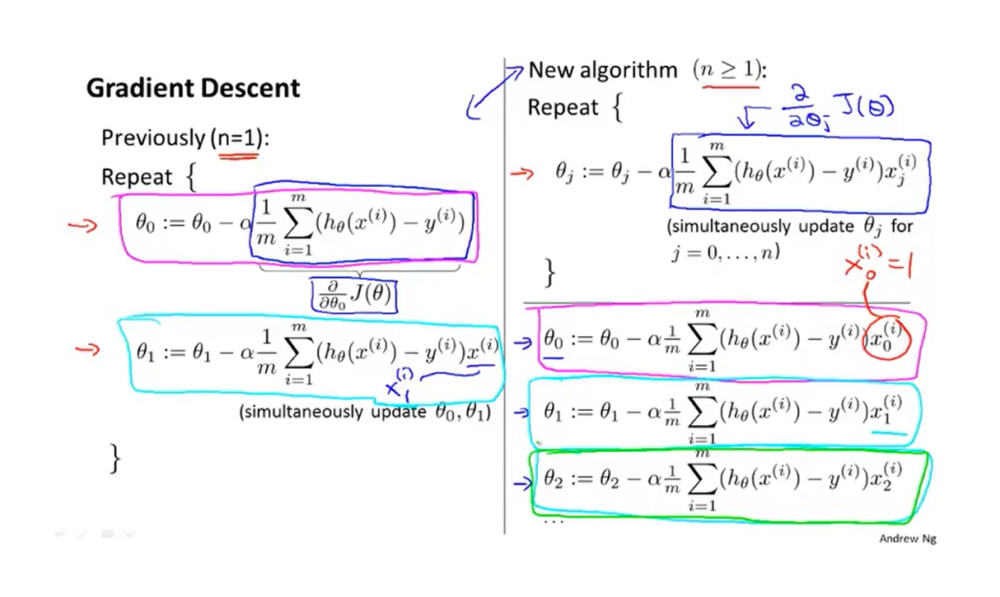
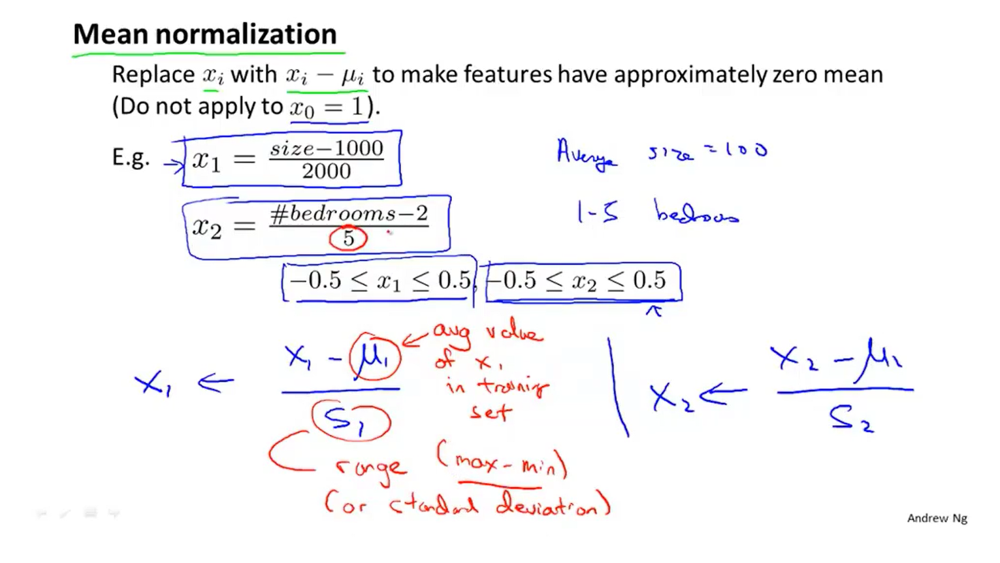
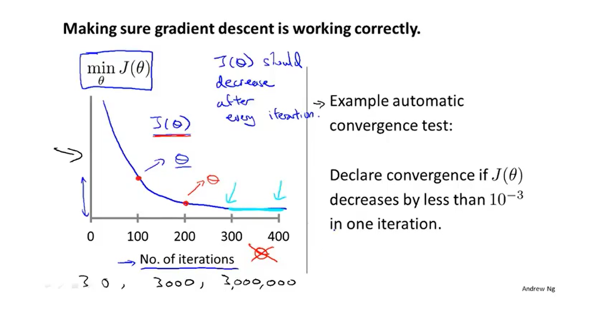
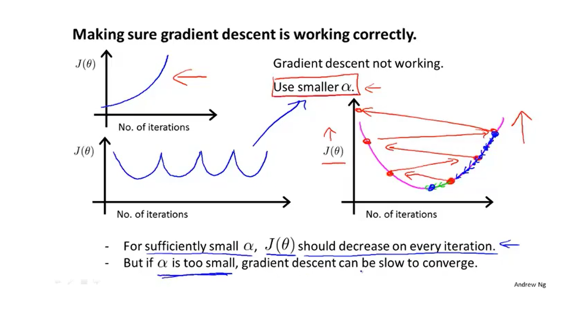

## 一、多元线性回归

### 1.多特征房价预测

##### 注:n代表特征属性数量，m代表样本数据数量

### 2.简化

##### 注:右边为内积，即θ的转置乘以x

## 二、多元梯度下降法

### 1.多元梯度下降公式

##### 注:i相当于行索引，j相当于列索引

### 2.多元梯度下降法:特征缩放

##### 注:特征缩放可以让梯度下降快一些，收敛所需迭代次数更少

##### 注:μ为数据平局值，s为标准差，但一般用最大值减最小值即可

### 3.多元梯度下降法:学习率

##### 1).自动收敛测试

##### 注:x轴代表收敛次数，y轴代表代价函数值

##### 2).收敛异常

##### 注:出现通常为学习率过大，数学家以证明随着学习率减小代价函数一定会下降，太小会收敛的很慢

### 4.特征和多项式回归

##### 注:特征选择可以更改为更合适的，如房屋拥有的土地宽度，深度两个特征简化为房屋面积

##### 注:模型要考虑合理性，如房屋价格与土地如果为平方关系，可能会随着房屋增长下降，但这不符合常识

## 五、正规方程

### 1.梯度下降和正规方程的优缺点:

### 2.不可逆的正规方程如何解决:

##### 注:如果特征过多可以考虑删除一些特征